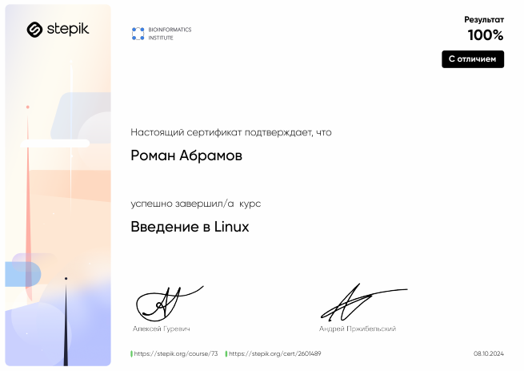
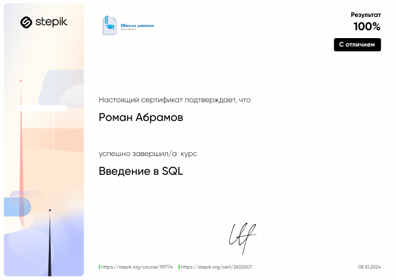
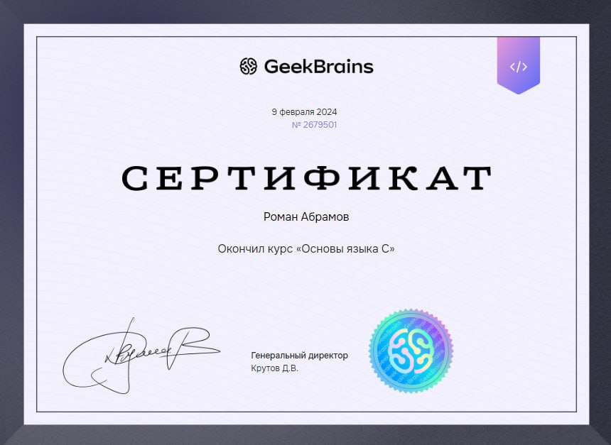
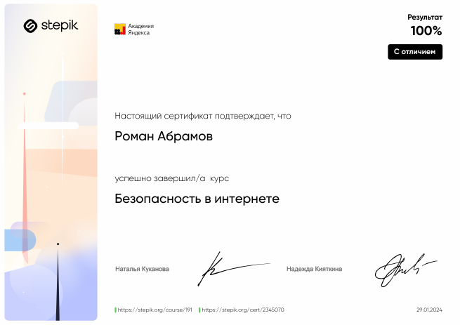
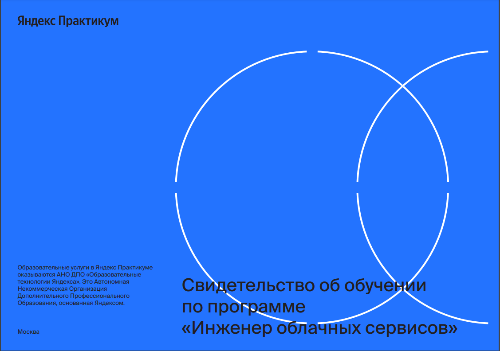
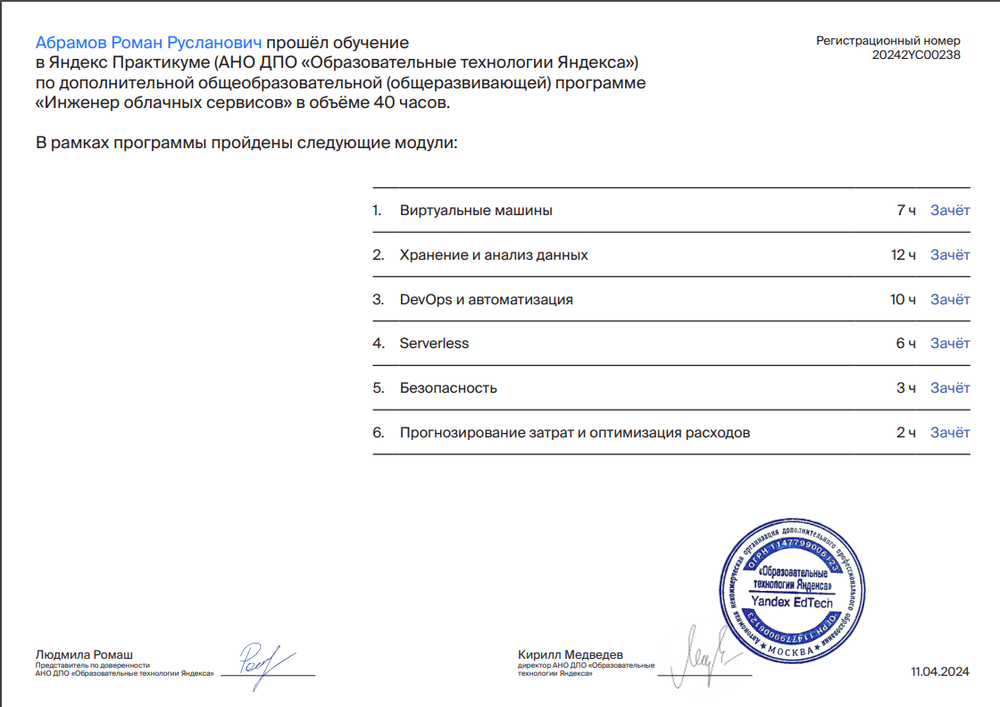

## Список пройденных курсов

- [Введение в Linux](#ВведениевLinux)
- [Введение в SQL](#ВведениевSQL)
- [Основы языка C](#ОсновыязыкаC)
- [Безопасность в интернете](#Безопасностьвинтернете)
- [Инженер облачных сервисов](#Инженероблачныхсервисов)

# Введение в Linux

  

# Введение в SQL

  

# Основы языка C

  

# Безопасность в интернете

  

# Инженер облачных сервисов

  
  

